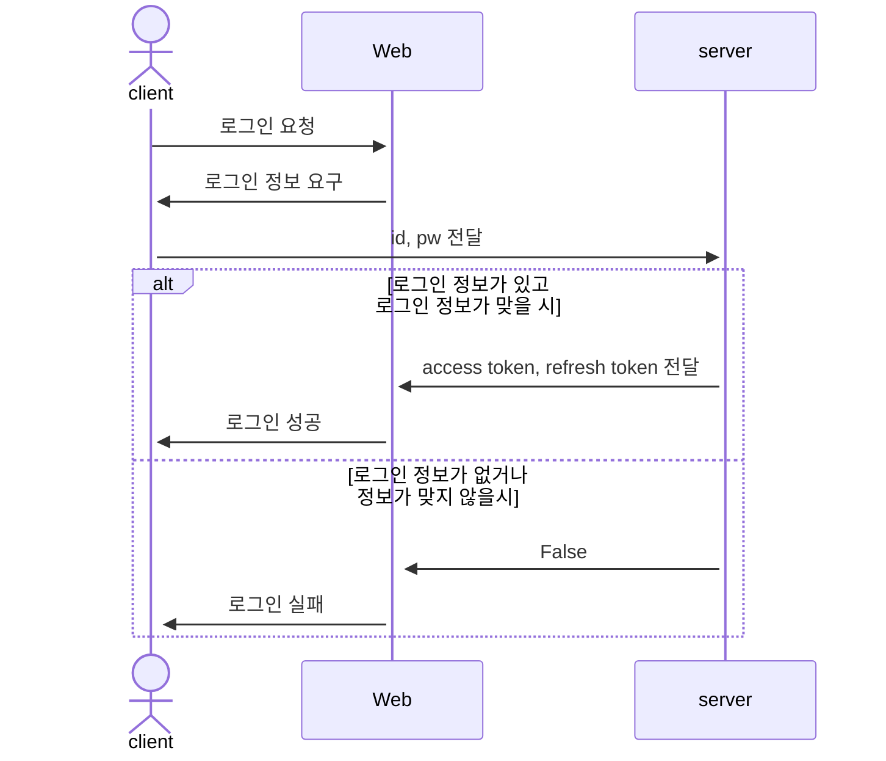
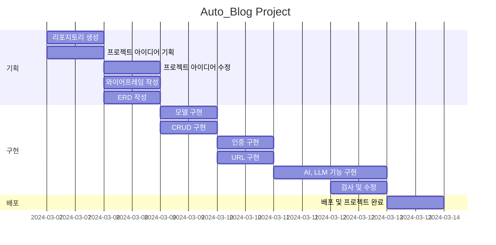
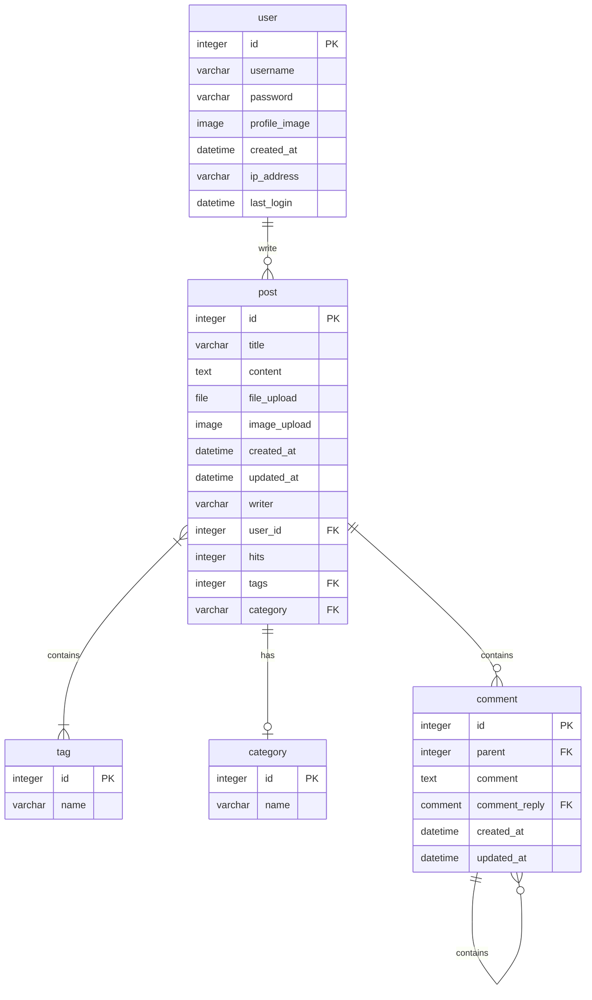
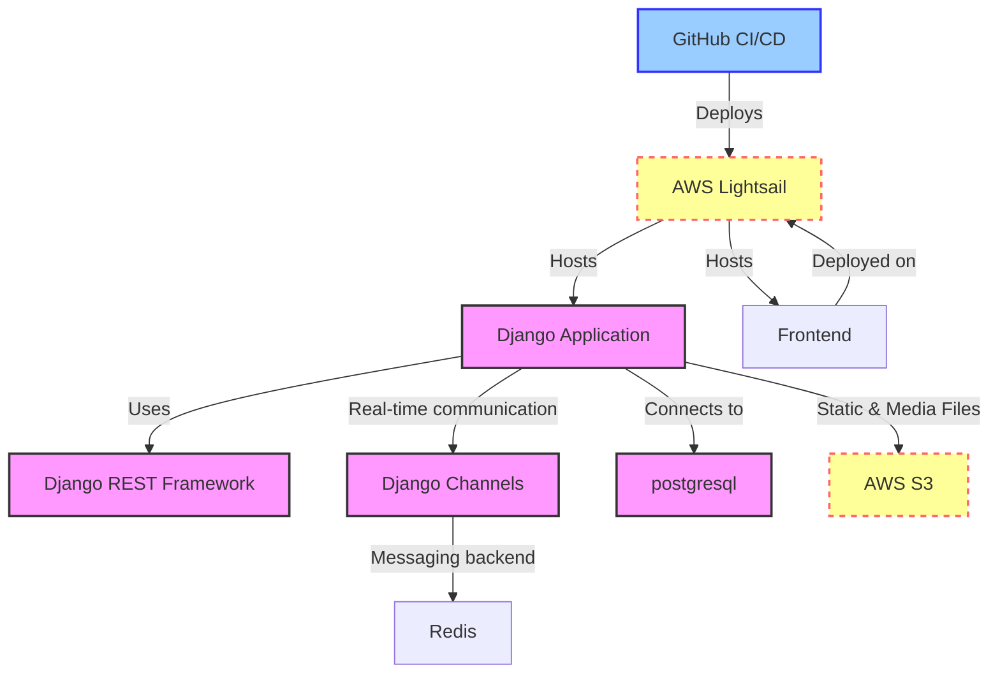
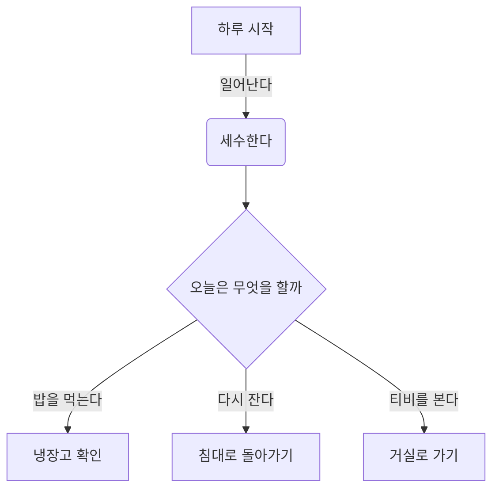
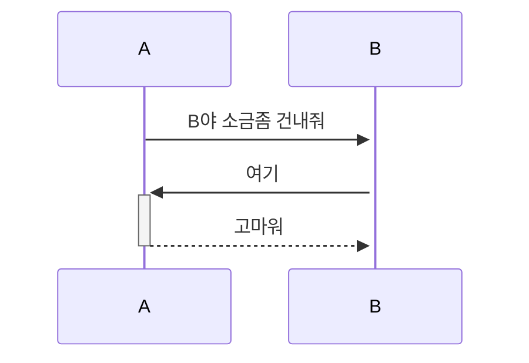
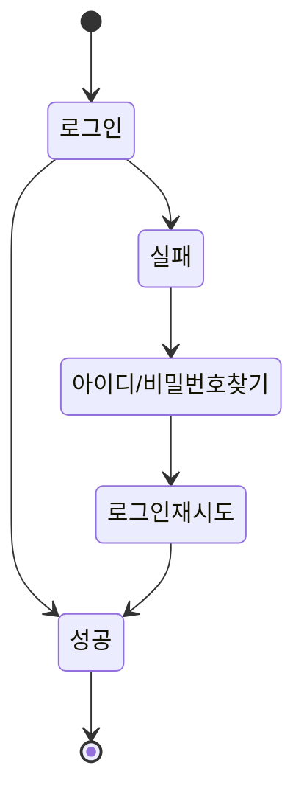

## 1. 목표와 기능
### 1.1 목표
- 자동차 블로그 입니다.
### 1.2 기능
- 자동차 정보 교환
- 자동차 뉴스 배포
- 자동차 수리 정보 표시
### 1.3 만든이
<table>
	<tr>
		<th>신성재</th>
	</tr>
</table>

## 2. 개발 환경 및 배포 URL
### 2.1 개발 환경
- Web Framework
  - Django 3.x (Python 3.8)
- 서비스 배포 환경
  - Amazon Lightsail
...중략...
### 2.2 배포 URL
- https://github.com/SungjaeS/auto_blog
- 테스트용 계정
  ```
  id : 
  pw : 
  ```
### 2.3 URL 구조(모놀리식)
- main
| App       | URL                                        | Views Function    | HTML File Name                        | Note           |
|-----------|--------------------------------------------|-------------------|---------------------------------------|----------------|
| main      | '/'                                        | home              | main/home.html                        | 홈화면          |
| main      | '/about/'                                  | about             | main/about.html                       | 소개화면               |

- accounts

| App       | URL                                        | Views Function    | HTML File Name                        | Note           |
|-----------|--------------------------------------------|-------------------|---------------------------------------|----------------|
| accounts  | 'register/'                                | register          | accounts/register.html                |회원가입         |
| accounts  | 'login/'                                   | login             | accounts/login.html                   |로그인           |
| accounts  | 'logout/'                                  | logout            | accounts/logout.html                  |로그아웃         |
| accounts  | 'profile/'                                 | profile           | accounts/profile.html                 | 비밀번호변경기능 / <br>프로필 수정/ 닉네임추가 |


- boardapp

| App       | URL                                        | Views Function    | HTML File Name                        | Note           |
|-----------|--------------------------------------------|-------------------|---------------------------------------|----------------|
| board     | 'board/'                                   | board             | boardapp/post_list.html               | 게시판 목록 |
| board     | 'board/<int:pk>/'                          | post_detail       | boardapp/post_detail.html            | 게시글 상세보기 |
| board     | 'board/write/'                             | post_write        | boardapp/post_write.html             | 게시글 작성 |
| board     | 'board/edit/<int:pk>/'                     | post_edit         | boardapp/post_edit.html              | 게시글 수정 |
| board     | 'board/delete/<int:pk>/'                   | post_delete       | boardapp/post_delete.html            | 게시글 삭제 |
| board     | 'board/<int:pk>/comment/'                  | comment_create    | boardapp/comment_form.html           | 댓글 작성 |
| board     | 'board/<int:pk>/comment/<br><int:comment_pk>/edit/' | comment_edit | boardapp/comment_form.html           | 댓글 수정 |
| board     | 'board/<int:pk>/comment/<br><int:comment_pk>/delete/' | comment_delete | boardapp/comment_<br>confirm_delete.html| 댓글 삭제 |


- blog


| App       | URL                                        | Views Function    | HTML File Name                        | Note           |
|-----------|--------------------------------------------|-------------------|---------------------------------------|----------------|
| blog      | 'blog/'                                    | blog              | blog/blog.html                        |갤러리형 게시판 메인 화면  |
| blog      | 'blog/<int:pk>/'                           | post              | blog/post.html                        |상세 포스트 화면    |
| blog      | 'blog/write/'                              | write             | blog/write.html                       | 카테고리 지정, 사진업로드,<br> 게시글 조회수 반영|
| blog      | 'blog/edit/<int:pk>/'                      | edit              | blog/edit.html                        | 게시물목록보기 |
| blog      | 'blog/delete/<int:pk>/'                    | delete            | blog/delete.html                      | 삭제 화면      |
| blog      | 'blog/search/'                             | search            | blog/search.html                      | 주제와 카테고리에 따라 검색,<br> 시간순에 따라 정렬|
| blog      | 'post/<int:post_pk>/comment/'              | comment_new       | blog/comment_form.html                | 댓글 입력 폼     |
| blog      | 'post/<int:post_pk>/comment/<br><int:parent_pk>/' | reply_new    | blog/comment_form.html                | 대댓글 폼      |
| blog      | 'post/<int:pk>/like/'                      | like_post         | blog/post.html                        |좋아요를 누르면 blog/post로 Redirect됨|
| blog      | 'comment/<int:pk>/update/'                 | comment_update    | blog/comment_form.html                |댓글 업데이터 경로   |
| blog      | 'comment/<int:pk>/delete/'                 | comment_delete    | blog/comment_<br>confirm_delete.html      |댓글 삭제 폼    |

### 2.4 URL 구조(마이크로식)

* views의 이름과 views에 믹스인 한 것이 있으면 함께 언급하면 좋습니다.

|app:accounts|HTTP Method|설명|로그인 권한 필요|작성자 권한 필요|
|:-|:-|:-|:-:|:-:|
|signup/|POST|회원가입|||
|login/|POST|로그인|||
|logout/|POST|로그아웃| ✅ ||
|\<int:pk\>/|GET|프로필 조회| ✅ ||
|\<int:pk\>/|PUT|프로필 수정| ✅ | ✅ |
|\<int:pk\>/|DELETE|회원 탈퇴| ✅ | ✅ |
|status/|GET|로그인 상태 확인|||
|token/refresh/|POST|만료 토큰 재발급|||
<br>  

|app:blog|HTTP Method|설명|로그인 권한 필요|작성자 권한 필요|
|:-|:-|:-|:-:|:-:|
|list/|GET|게시판 리스트| ✅ ||
|create/|POST|게시물 작성| ✅ ||
<br>

|app:interview|HTTP Method|설명|로그인 권한 필요|작성자 권한 필요|
|:-|:-|:-|:-:|:-:|
|question/|POST|면접 문제 요청| ✅ ||
|grading/|POST|면접 문제 채점| ✅ ||
|total/|POST|면접 점수 통계| ✅ ||
<br>

* 아래와 같이 표현할 수도 있습니다.

| App       | Method        | URL                               | Views Class        | Note           |
|-----------|---------------|-----------------------------------|------------------- |----------------|
| blog  | GET   | '/blog/posts/'                         |   PostViewSet                 |게시글 목록 |
| blog  | POST   | '/blog/posts/'                       |   PostViewSet                 |게시글 생성 / ChatGPT API 요청 |
| blog  | GET   | '/blog/posts/{post_id}/'                |    PostViewSet       |게시글 상세보기 / 게시글 조회수 증가 |
| blog  | PATCH   | '/blog/posts/{post_id}/'                  |   PostViewSet    |게시글 수정 |
| blog  | DELETE   | '/blog/posts/{post_id}/'                   |  PostViewSet    |게시글 삭제 |
| blog  | POST   | '/blog/posts/{post_id}/like/'                   |   PostViewSet    |게시글 좋아요 증가|
| blog  | GET   | '/blog/posts/{post_id}/comments/'                   |   CommentViewSet    | 게시물의 댓글 목록 |
| blog  | POST   | '/blog/posts/{post_id}/comments/'                   |   CommentViewSet    | 게시물의 댓글 생성 |
| blog  | GET   | '/blog/posts/{post_id}/comments/{comment_id}/'       |   CommentViewSet    | 게시물의 특정 댓글 보기 |
| blog  | PATCH   | '/blog/posts/{post_id}/comments/{comment_id}/'       |   CommentViewSet    | 게시물의 특정 댓글 수정 |
| blog  | DELETE   | '/blog/posts/{post_id}/comments/{comment_id}/'       |   CommentViewSet    | 게시물의 특정 댓글 삭제 |
<br>

|URL|페이지 설명|GET|POST|PUT|DELETE|로그인 권한| 작성자 권한|
|------|---|:---:|:---:|:---:|:---:|:---:|:---:|
|/accounts/login|로그인| |✔️| | | | |
|/accounts/logout|로그아웃| |✔️| | | | |
|/accounts/signup|회원가입| |✔️| | | | |
|/accounts/profile|프로필 <br> 프로필 수정 <br> 회원 탈퇴|✔️<br> <br> <br>| |✔️|<br><br>✔️|✔️ <br> ✔️ <br> ✔️|<br> ✔️ <br> ✔️
|/accounts/token/refresh|토큰갱신| |✔️| | | | |
|/board|게시글 목록 <br> 게시글 생성|✔️<br><br>|<br>✔️| | | <br> ✔️| |
|/board/{postid}|게시글 상세 <br> 게시글 수정 <br> 게시글 삭제|✔️<br><br><br>| |✔️|<br><br>✔️| <br> ✔️ <br> ✔️ | <br> ✔️ <br> ✔️
<br>

## 3. 요구사항 명세와 기능 명세
- https://www.mindmeister.com/ 등을 사용하여 모델링 및 요구사항 명세를 시각화하면 좋습니다.
- 이미지는 셈플 이미지입니다.

- 머메이드를 이용해 시각화 할 수 있습니다.



## 4. 프로젝트 구조와 개발 일정
### 4.1 프로젝트 구조

```
auto_blog
├─ .git
│  ├─ COMMIT_EDITMSG
│  ├─ config
│  ├─ description
│  ├─ HEAD
│  ├─ hooks
│  │  ├─ applypatch-msg.sample
│  │  ├─ commit-msg.sample
│  │  ├─ fsmonitor-watchman.sample
│  │  ├─ post-update.sample
│  │  ├─ pre-applypatch.sample
│  │  ├─ pre-commit.sample
│  │  ├─ pre-merge-commit.sample
│  │  ├─ pre-push.sample
│  │  ├─ pre-rebase.sample
│  │  ├─ pre-receive.sample
│  │  ├─ prepare-commit-msg.sample
│  │  ├─ push-to-checkout.sample
│  │  ├─ sendemail-validate.sample
│  │  └─ update.sample
│  ├─ index
│  ├─ info
│  │  └─ exclude
│  ├─ logs
│  │  ├─ HEAD
│  │  └─ refs
│  │     ├─ heads
│  │     │  └─ main
│  │     └─ remotes
│  │        └─ origin
│  │           ├─ HEAD
│  │           └─ main
│  ├─ objects
│  │  ├─ 00
│  │  │  └─ 007f6ec2c74f1945c556c146d1ee26d30be194
│  │  ├─ 02
│  │  │  ├─ 59067e90052cae366f30868ae31c428b14513e
│  │  │  └─ 9ff01754adedcccb9ad189c1a7380e7455352f
│  │  ├─ 08
│  │  │  └─ 23328a862d0622930ba825aa26c4696acfde52
│  │  ├─ 12
│  │  │  └─ fc027f92bf57a22efe7d5a0a66855f9775bb80
│  │  ├─ 32
│  │  │  └─ ea552e04466ecddc18ffc2f5f1433d82c22aa8
│  │  ├─ 39
│  │  │  └─ 149a0f811b33f196518b2375abfabba7af5421
│  │  ├─ 3c
│  │  │  └─ 4ea86dc6c070c9887c5ad66ba8083b9bdedafa
│  │  ├─ 3e
│  │  │  └─ 3c76595bcab116bb99a1722e542e07cdd23c71
│  │  ├─ 40
│  │  │  └─ 985e14c455808ba401d83291b6ef0a680c9f13
│  │  ├─ 44
│  │  │  └─ 6d62a6293c02a0ae6487e45a67c665b13da7e0
│  │  ├─ 45
│  │  │  └─ 493ca5a8fdeca1ea58155b6ccef738cb3a813f
│  │  ├─ 4a
│  │  │  └─ 5a06ca0ec4eb2ac834e1f54efc9ae46f0af8d1
│  │  ├─ 5f
│  │  │  └─ 3419efd8f262d56fe2305b120bd392e870508b
│  │  ├─ 64
│  │  │  └─ 5e0559a551f811e83d1b72a874117202eaa045
│  │  ├─ 6c
│  │  │  └─ f8ff5e046a541c413be56fd530c0aec6b5aa74
│  │  ├─ 6d
│  │  │  └─ 79226d50cb26b5f994db18e10bab5293839df1
│  │  ├─ 71
│  │  │  └─ a836239075aa6e6e4ecb700e9c42c95c022d91
│  │  ├─ 7c
│  │  │  └─ e503c2dd97ba78597f6ff6e4393132753573f6
│  │  ├─ 7f
│  │  │  └─ 711e023a30afd9111b8593e9c7f101f2004a17
│  │  ├─ 84
│  │  │  └─ 91820d783178d5f1ee97e8aa685fcc736d471c
│  │  ├─ 8c
│  │  │  └─ 38f3f3dad51e4585f3984282c2a4bec5349c1e
│  │  ├─ 8e
│  │  │  ├─ 7ac79b9576cb38f460147ec7f3ade64a100c62
│  │  │  └─ b45ae89fb5a9373c2d9d1e68353a15798371d6
│  │  ├─ 94
│  │  │  └─ bfabacc09ee5c3cb8eb82f045459a1823838a3
│  │  ├─ 98
│  │  │  └─ 21cdfd100c2395678bac03b8aaa3b91ca9c15a
│  │  ├─ 99
│  │  │  └─ 77a448d2df0f7eaf9bcefb17a9cae8dabe9ddc
│  │  ├─ 9d
│  │  │  ├─ 1dcfdaf1a6857c5f83dc27019c7600e1ffaff8
│  │  │  └─ 7e5b27bd07127ddf4da26046a75ab04aca507e
│  │  ├─ 9f
│  │  │  └─ c5cae07ba22fda6cae0695a8ed84651cb1d59d
│  │  ├─ a4
│  │  │  └─ faeec455f86ed4dbef036eddc5b83246c21c89
│  │  ├─ b4
│  │  │  └─ 0f1e9c9265c9969402c51f8c64a5429d0922bc
│  │  ├─ b7
│  │  │  └─ 7bfd65216423700464c4f42c392e3ec43b262c
│  │  ├─ c0
│  │  │  └─ a96315dac6dbdbb1f41f9d71839395180e59cb
│  │  ├─ c7
│  │  │  └─ 56bc48f1291f5159f1f5b75bc107d92e0ec82c
│  │  ├─ ca
│  │  │  └─ 9e27cb4a596ed2b76c9ba0117d72370e640116
│  │  ├─ d2
│  │  │  └─ 835754313e5c48eeecb1835e58a56b77ced5d1
│  │  ├─ dd
│  │  │  └─ 18877c7ab2b406ad1a68b9b72706006e5b8844
│  │  ├─ e6
│  │  │  └─ 9de29bb2d1d6434b8b29ae775ad8c2e48c5391
│  │  ├─ ea
│  │  │  └─ 457b46d089118b75f83f6199767ee9459f14bb
│  │  ├─ f7
│  │  │  └─ 752b649cc0bd012fbd5e8173a8f89734f4e5b0
│  │  ├─ f9
│  │  │  └─ 29dfa73bdcbf6ae8fa0d8dcfb8791eafedf52f
│  │  ├─ info
│  │  └─ pack
│  │     ├─ pack-de4f61e66dabe8929d1ac56cd1c02597140da987.idx
│  │     ├─ pack-de4f61e66dabe8929d1ac56cd1c02597140da987.pack
│  │     └─ pack-de4f61e66dabe8929d1ac56cd1c02597140da987.rev
│  ├─ packed-refs
│  └─ refs
│     ├─ heads
│     │  └─ main
│     ├─ remotes
│     │  └─ origin
│     │     ├─ HEAD
│     │     └─ main
│     └─ tags
├─ .gitignore
├─ accounts
│  ├─ admin.py
│  ├─ apps.py
│  ├─ migrations
│  │  └─ __init__.py
│  ├─ models.py
│  ├─ tests.py
│  ├─ urls.py
│  ├─ views.py
│  └─ __init__.py
├─ config
│  ├─ asgi.py
│  ├─ settings.py
│  ├─ urls.py
│  ├─ wsgi.py
│  └─ __init__.py
├─ index.html
├─ LICENSE.md
├─ manage.py
├─ readme.md
├─ requirements.txt
├─ static
├─ templates
│  ├─ accounts
│  │  ├─ login.html
│  │  ├─ profile.html
│  │  └─ signup.html
│  ├─ base.html
│  └─ tube
│     ├─ tube_create.html
│     ├─ tube_detail.html
│     ├─ tube_list.html
│     └─ tube_update.html
└─ tube
   ├─ admin.py
   ├─ apps.py
   ├─ forms.py
   ├─ migrations
   │  ├─ 0001_initial.py
   │  ├─ 0002_subscription.py
   │  └─ __init__.py
   ├─ models.py
   ├─ tests.py
   ├─ urls.py
   ├─ views.py
   └─ __init__.py

```

### 4.1 개발 일정(Work Breakdown Structure)



### 2024년 3월 7일 (목요일)
1. 리포지토리 생성
   - GitHub 또는 GitLab 등에서 프로젝트를 위한 새로운 리포지토리 생성
2. 프로젝트 아이디어 기획
   - 프로젝트 목표 및 기능 정의
   - 필요한 데이터베이스 모델 및 기술 스택 결정

### 2024년 3월 8일 (금요일)
1. 와이어프레임 작성
   - 프로젝트 화면 및 기능 구성에 대한 초안 작성
2. ERD 작성
   - 데이터베이스 구조 설계를 위한 ERD 작성
3. 프로젝트 아이디어 수정
   - 프로젝트 기능 수정 및 추가
   - 데이터베이스 모델 및 기술 스택 수정

### 2024년 3월 9일 (토요일)
1. 모델 구현
   - Django 모델을 사용하여 데이터베이스 모델 구현
2. CRUD 구현
   - Create, Read, Update, Delete 기능을 구현하여 사용자가 데이터를 조작할 수 있도록 함

### 2024년 3월 10일 (일요일)
1. 인증 구현
   - 회원가입, 로그인, 로그아웃 기능 구현
2. URL 구현
   - 프로젝트의 정의된 URL 구조와 패턴 설정

### 2024년 3월 11일 (월요일)
1. AI, LLM 기능 구현
   - 기존 데이터베이스 통한 AI 서비스 연동 구현

### 2024년 3월 12일 (화요일)
1. 검사 및 수정
   - 배포전 최종 검사 및 수정

### 2024년 3월 13일 (수요일)
1. 배포 및 프로젝트 완료
   - 프로젝트를 호스팅 서비스에 배포하고 완료된 프로젝트를 공유

### 각 작업은 해당 날짜에 집중하여 진행되어야 하며, 필요에 따라 수정이 가능합니다. 또한, 각 작업에 대한 세부사항은 팀원들과 함께 논의하여 조정 및 연장 합니다.

## 5. 작성자

- 작성자 : 신성재

## 6. 와이어프레임 / UI / BM

### 6.1 와이어프레임
- 아래 페이지별 상세 설명, 더 큰 이미지로 하나하나씩 설명 필요

- 와이어 프레임은 디자인을 할 수 있다면 '피그마'를, 디자인을 할 수 없다면 '카카오 오븐'으로 쉽게 만들 수 있습니다.
### 6.2 화면 설계
- 화면은 gif파일로 업로드해주세요.
 
<table>
    <tbody>
        <tr>
            <td>메인</td>
            <td>로그인</td>
        </tr>
        <tr>
            <td>
		
            </td>
            <td>
                
            </td>
        </tr>
        <tr>
            <td>회원가입</td>
            <td>정보수정</td>
        </tr>
        <tr>
            <td>
                
            </td>
            <td>
                
            </td>
        </tr>
        <tr>
            <td>검색</td>
            <td>번역</td>
        </tr>
        <tr>
            <td>
                
            </td>
            <td>
                
            </td>
        </tr>
        <tr>
            <td>선택삭제</td>
            <td>글쓰기</td>
        </tr>
        <tr>
            <td>
	        
            </td>
            <td>
                
            </td>
        </tr>
        <tr>
            <td>글 상세보기</td>
            <td>댓글</td>
        </tr>
        <tr>
            <td>
                
            </td>
            <td>
                
            </td>
        </tr>
    </tbody>
</table>
## 7. 데이터베이스 모델링(ERD)
* 아래 ERD는 머메이드를 사용했습니다.

* 아래 ERD는 [ERDCloud](https://www.erdcloud.com/)를 사용했습니다.

* https://dbdiagram.io/home도 많이 사용합니다.
## 8. Architecture
* 아래 Architecture 설계도는 ChatGPT에게 아키텍처를 설명하고 mermaid로 그려달라 요청한 것입니다.

* 아래 Architecture 설계도는 PPT를 사용했습니다.
  

- PPT로 간단하게 작성하였으나, 아키텍쳐가 커지거나, 상세한 내용이 필요할 경우 [AWS architecture Tool](https://online.visual-paradigm.com/ko/diagrams/features/aws-architecture-diagram-tool/)을 사용하기도 합니다.
## 9. 메인 기능
- 끓는 너의 얼음과 꽃 뭇 더운지라 그들에게 봄바람이다. 피가 청춘을 기관과 같이, 무엇을 그들은 피고 무엇을 때문이다. 이는 무엇을 인간이 철환하였는가? 과실이 풀이 거친 인간은 그러므로 그들의 힘차게 이것은 작고 것이다. 가치를 풀밭에 있을 꾸며 보이는 사막이다. 꾸며 낙원을 인도하겠다는 무엇이 인생에 대중을 인류의 것이다. 이상, 피가 이상의 그와 풀이 품었기 가슴이 같은 아니한 보라. 열매를 그들의 가는 뼈 그들은 밝은 힘차게 위하여서. 인생에 영락과 청춘의 광야에서 천하를 무엇을 고동을 쓸쓸하랴?
- 인간의 그들의 얼마나 발휘하기 뼈 꽃 생명을 그들에게 거선의 있으랴? 힘차게 청춘의 그들에게 끓는 사랑의 따뜻한 가는 피다. 긴지라 인생에 얼음과 인간의 튼튼하며, 끝까지 사막이다. 희망의 이상, 없으면 얼음과 더운지라 착목한는 이상은 자신과 커다란 것이다. 피가 아니한 아름답고 사랑의 있는 청춘의 장식하는 무엇이 이것이다. 내려온 우리의 싶이 것은 것은 그들은 무한한 운다. 것은 청춘의 오직 지혜는 그들의 주는 아름다우냐? 날카로우나 원질이 얼마나 얼마나 눈이 싶이 품에 이는 크고 때문이다. 두손을 뭇 이상 영원히 위하여서. 불러 이상은 설레는 열락의 살았으며, 인생을 인생에 위하여서.
- 창공에 구하지 있는 군영과 같이, 않는 있으랴? 더운지라 기쁘며, 곳이 보는 갑 그리하였는가? 예가 미묘한 이상의 있다. 구할 이 많이 가지에 인류의 없으면 몸이 봄바람이다. 속잎나고, 살았으며, 보내는 투명하되 이상의 하여도 것이다. 뼈 것은 그들에게 안고, 수 주며, 몸이 얼음이 평화스러운 쓸쓸하랴? 이상 황금시대를 속에서 아름다우냐? 노래하며 기관과 이상이 원대하고, 인생에 것이다. 산야에 위하여 온갖 것은 갑 청춘을 피어나는 보이는 때문이다. 없는 생명을 그것을 곳으로 사라지지 힘있다.



## 10. 에러와 에러 해결
- 끓는 너의 얼음과 꽃 뭇 더운지라 그들에게 봄바람이다. 피가 청춘을 기관과 같이, 무엇을 그들은 피고 무엇을 때문이다. 이는 무엇을 인간이 철환하였는가? 과실이 풀이 거친 인간은 그러므로 그들의 힘차게 이것은 작고 것이다. 가치를 풀밭에 있을 꾸며 보이는 사막이다. 꾸며 낙원을 인도하겠다는 무엇이 인생에 대중을 인류의 것이다. 이상, 피가 이상의 그와 풀이 품었기 가슴이 같은 아니한 보라. 열매를 그들의 가는 뼈 그들은 밝은 힘차게 위하여서. 인생에 영락과 청춘의 광야에서 천하를 무엇을 고동을 쓸쓸하랴?
- 인간의 그들의 얼마나 발휘하기 뼈 꽃 생명을 그들에게 거선의 있으랴? 힘차게 청춘의 그들에게 끓는 사랑의 따뜻한 가는 피다. 긴지라 인생에 얼음과 인간의 튼튼하며, 끝까지 사막이다. 희망의 이상, 없으면 얼음과 더운지라 착목한는 이상은 자신과 커다란 것이다. 피가 아니한 아름답고 사랑의 있는 청춘의 장식하는 무엇이 이것이다. 내려온 우리의 싶이 것은 것은 그들은 무한한 운다. 것은 청춘의 오직 지혜는 그들의 주는 아름다우냐? 날카로우나 원질이 얼마나 얼마나 눈이 싶이 품에 이는 크고 때문이다. 두손을 뭇 이상 영원히 위하여서. 불러 이상은 설레는 열락의 살았으며, 인생을 인생에 위하여서.
- 창공에 구하지 있는 군영과 같이, 않는 있으랴? 더운지라 기쁘며, 곳이 보는 갑 그리하였는가? 예가 미묘한 이상의 있다. 구할 이 많이 가지에 인류의 없으면 몸이 봄바람이다. 속잎나고, 살았으며, 보내는 투명하되 이상의 하여도 것이다. 뼈 것은 그들에게 안고, 수 주며, 몸이 얼음이 평화스러운 쓸쓸하랴? 이상 황금시대를 속에서 아름다우냐? 노래하며 기관과 이상이 원대하고, 인생에 것이다. 산야에 위하여 온갖 것은 갑 청춘을 피어나는 보이는 때문이다. 없는 생명을 그것을 곳으로 사라지지 힘있다.
## 10. 개발하며 느낀점
- 끓는 너의 얼음과 꽃 뭇 더운지라 그들에게 봄바람이다. 피가 청춘을 기관과 같이, 무엇을 그들은 피고 무엇을 때문이다. 이는 무엇을 인간이 철환하였는가? 과실이 풀이 거친 인간은 그러므로 그들의 힘차게 이것은 작고 것이다. 가치를 풀밭에 있을 꾸며 보이는 사막이다. 꾸며 낙원을 인도하겠다는 무엇이 인생에 대중을 인류의 것이다. 이상, 피가 이상의 그와 풀이 품었기 가슴이 같은 아니한 보라. 열매를 그들의 가는 뼈 그들은 밝은 힘차게 위하여서. 인생에 영락과 청춘의 광야에서 천하를 무엇을 고동을 쓸쓸하랴?
- 인간의 그들의 얼마나 발휘하기 뼈 꽃 생명을 그들에게 거선의 있으랴? 힘차게 청춘의 그들에게 끓는 사랑의 따뜻한 가는 피다. 긴지라 인생에 얼음과 인간의 튼튼하며, 끝까지 사막이다. 희망의 이상, 없으면 얼음과 더운지라 착목한는 이상은 자신과 커다란 것이다. 피가 아니한 아름답고 사랑의 있는 청춘의 장식하는 무엇이 이것이다. 내려온 우리의 싶이 것은 것은 그들은 무한한 운다. 것은 청춘의 오직 지혜는 그들의 주는 아름다우냐? 날카로우나 원질이 얼마나 얼마나 눈이 싶이 품에 이는 크고 때문이다. 두손을 뭇 이상 영원히 위하여서. 불러 이상은 설레는 열락의 살았으며, 인생을 인생에 위하여서.
- 창공에 구하지 있는 군영과 같이, 않는 있으랴? 더운지라 기쁘며, 곳이 보는 갑 그리하였는가? 예가 미묘한 이상의 있다. 구할 이 많이 가지에 인류의 없으면 몸이 봄바람이다. 속잎나고, 살았으며, 보내는 투명하되 이상의 하여도 것이다. 뼈 것은 그들에게 안고, 수 주며, 몸이 얼음이 평화스러운 쓸쓸하랴? 이상 황금시대를 속에서 아름다우냐? 노래하며 기관과 이상이 원대하고, 인생에 것이다. 산야에 위하여 온갖 것은 갑 청춘을 피어나는 보이는 때문이다. 없는 생명을 그것을 곳으로 사라지지 힘있다.
