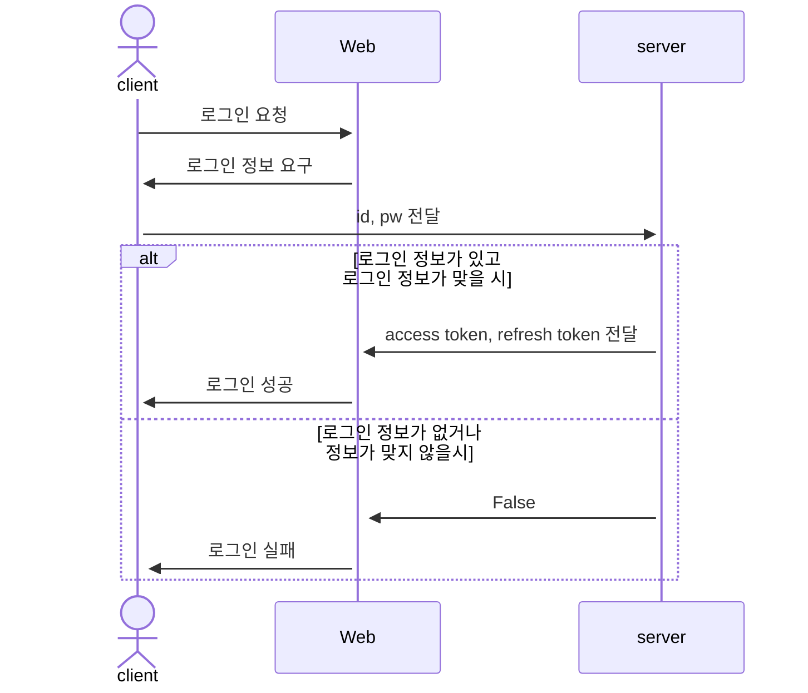
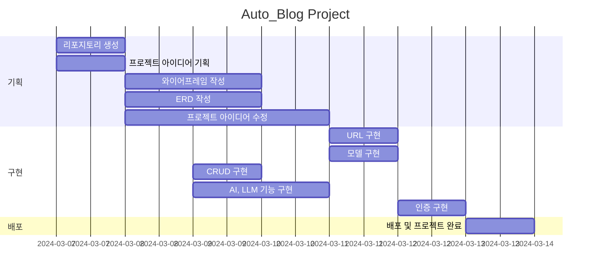

## 1. 목표와 기능
### 1.1 목표
- 자동차 블로그 입니다.
### 1.2 기능
- 자동차 정보 교환
- 자동차 뉴스 배포
- 자동차 수리 정보 표시
### 1.3 만든이
<table>
	<tr>
		<th>신성재</th>
	</tr>
 	<tr>
		<td></td>
	</tr>

</table>

## 2. 개발 환경 및 배포 URL
@@ -44,272 +42,7 @@

- accounts

| App       | URL                                        | Views Function    | HTML File Name                        | Note           |
|-----------|--------------------------------------------|-------------------|---------------------------------------|----------------|
| accounts  | 'register/'                                | register          | accounts/register.html                |회원가입         |
| accounts  | 'login/'                                   | login             | accounts/login.html                   |로그인           |
| accounts  | 'logout/'                                  | logout            | accounts/logout.html                  |로그아웃         |
| accounts  | 'profile/'                                 | profile           | accounts/profile.html                 | 비밀번호변경기능 /  프로필 수정/ 닉네임추가 |

- boardapp

| App       | URL                                        | Views Function    | HTML File Name                        | Note           |
|-----------|--------------------------------------------|-------------------|---------------------------------------|----------------|
| board     | 'board/'                                   | board             | boardapp/post_list.html               | 게시판 목록 |
| board     | 'board/<int:pk>/'                          | post_detail       | boardapp/post_detail.html            | 게시글 상세보기 |
| board     | 'board/write/'                             | post_write        | boardapp/post_write.html             | 게시글 작성 |
| board     | 'board/edit/<int:pk>/'                     | post_edit         | boardapp/post_edit.html              | 게시글 수정 |
| board     | 'board/delete/<int:pk>/'                   | post_delete       | boardapp/post_delete.html            | 게시글 삭제 |
| board     | 'board/<int:pk>/comment/'                  | comment_create    | boardapp/comment_form.html           | 댓글 작성 |
| board     | 'board/<int:pk>/comment/ <int:comment_pk>/edit/' | comment_edit | boardapp/comment_form.html           | 댓글 수정 |
| board     | 'board/<int:pk>/comment/ <int:comment_pk>/delete/' | comment_delete | boardapp/comment_ confirm_delete.html| 댓글 삭제 |

- blog

| App       | URL                                        | Views Function    | HTML File Name                        | Note           |
|-----------|--------------------------------------------|-------------------|---------------------------------------|----------------|
| blog      | 'blog/'                                    | blog              | blog/blog.html                        |갤러리형 게시판 메인 화면  |
| blog      | 'blog/<int:pk>/'                           | post              | blog/post.html                        |상세 포스트 화면    |
| blog      | 'blog/write/'                              | write             | blog/write.html                       | 카테고리 지정, 사진업로드,  게시글 조회수 반영|
| blog      | 'blog/edit/<int:pk>/'                      | edit              | blog/edit.html                        | 게시물목록보기 |
| blog      | 'blog/delete/<int:pk>/'                    | delete            | blog/delete.html                      | 삭제 화면      |
| blog      | 'blog/search/'                             | search            | blog/search.html                      | 주제와 카테고리에 따라 검색,  시간순에 따라 정렬|
| blog      | 'post/<int:post_pk>/comment/'              | comment_new       | blog/comment_form.html                | 댓글 입력 폼     |
| blog      | 'post/<int:post_pk>/comment/ <int:parent_pk>/' | reply_new    | blog/comment_form.html                | 대댓글 폼      |
| blog      | 'post/<int:pk>/like/'                      | like_post         | blog/post.html                        |좋아요를 누르면 blog/post로 Redirect됨|
| blog      | 'comment/<int:pk>/update/'                 | comment_update    | blog/comment_form.html                |댓글 업데이터 경로   |
| blog      | 'comment/<int:pk>/delete/'                 | comment_delete    | blog/comment_ confirm_delete.html      |댓글 삭제 폼    |

### 2.4 URL 구조(마이크로식)

* views의 이름과 views에 믹스인 한 것이 있으면 함께 언급하면 좋습니다.

|app:accounts|HTTP Method|설명|로그인 권한 필요|작성자 권한 필요|
|:-|:-|:-|:-:|:-:|
|signup/|POST|회원가입|||
|login/|POST|로그인|||
|logout/|POST|로그아웃| ✅ ||
|\<int:pk\>/|GET|프로필 조회| ✅ ||
|\<int:pk\>/|PUT|프로필 수정| ✅ | ✅ |
|\<int:pk\>/|DELETE|회원 탈퇴| ✅ | ✅ |
|status/|GET|로그인 상태 확인|||
|token/refresh/|POST|만료 토큰 재발급|||
   

|app:blog|HTTP Method|설명|로그인 권한 필요|작성자 권한 필요|
|:-|:-|:-|:-:|:-:|
|list/|GET|게시판 리스트| ✅ ||
|create/|POST|게시물 작성| ✅ ||
 

|app:interview|HTTP Method|설명|로그인 권한 필요|작성자 권한 필요|
|:-|:-|:-|:-:|:-:|
|question/|POST|면접 문제 요청| ✅ ||
|grading/|POST|면접 문제 채점| ✅ ||
|total/|POST|면접 점수 통계| ✅ ||
 

* 아래와 같이 표현할 수도 있습니다.

| App       | Method        | URL                               | Views Class        | Note           |
|-----------|---------------|-----------------------------------|------------------- |----------------|
| blog  | GET   | '/blog/posts/'                         |   PostViewSet                 |게시글 목록 |
| blog  | POST   | '/blog/posts/'                       |   PostViewSet                 |게시글 생성 / ChatGPT API 요청 |
| blog  | GET   | '/blog/posts/{post_id}/'                |    PostViewSet       |게시글 상세보기 / 게시글 조회수 증가 |
| blog  | PATCH   | '/blog/posts/{post_id}/'                  |   PostViewSet    |게시글 수정 |
| blog  | DELETE   | '/blog/posts/{post_id}/'                   |  PostViewSet    |게시글 삭제 |
| blog  | POST   | '/blog/posts/{post_id}/like/'                   |   PostViewSet    |게시글 좋아요 증가|
| blog  | GET   | '/blog/posts/{post_id}/comments/'                   |   CommentViewSet    | 게시물의 댓글 목록 |
| blog  | POST   | '/blog/posts/{post_id}/comments/'                   |   CommentViewSet    | 게시물의 댓글 생성 |
| blog  | GET   | '/blog/posts/{post_id}/comments/{comment_id}/'       |   CommentViewSet    | 게시물의 특정 댓글 보기 |
| blog  | PATCH   | '/blog/posts/{post_id}/comments/{comment_id}/'       |   CommentViewSet    | 게시물의 특정 댓글 수정 |
| blog  | DELETE   | '/blog/posts/{post_id}/comments/{comment_id}/'       |   CommentViewSet    | 게시물의 특정 댓글 삭제 |
 

|URL|페이지 설명|GET|POST|PUT|DELETE|로그인 권한| 작성자 권한|
|------|---|:---:|:---:|:---:|:---:|:---:|:---:|
|/accounts/login|로그인| |✔️| | | | |
|/accounts/logout|로그아웃| |✔️| | | | |
|/accounts/signup|회원가입| |✔️| | | | |
|/accounts/profile|프로필   프로필 수정   회원 탈퇴|✔️     | |✔️|  ✔️|✔️   ✔️   ✔️|  ✔️   ✔️
|/accounts/token/refresh|토큰갱신| |✔️| | | | |
|/board|게시글 목록   게시글 생성|✔️  | ✔️| | |   ✔️| |
|/board/{postid}|게시글 상세   게시글 수정   게시글 삭제|✔️   | |✔️|  ✔️|   ✔️   ✔️ |   ✔️   ✔️
 

## 3. 요구사항 명세와 기능 명세
- https://www.mindmeister.com/ 등을 사용하여 모델링 및 요구사항 명세를 시각화하면 좋습니다.
- 이미지는 셈플 이미지입니다.

- 머메이드를 이용해 시각화 할 수 있습니다.

## 4. 프로젝트 구조와 개발 일정
### 4.1 프로젝트 구조
- 해당 프로젝트에서 폴더 트리 잘 다듬어 사용하세요. 필요하다면 주석을 달아주세요.
📦tutorial  
 ┣ 📂accounts  
 ┃ ┣ 📂migrations  
 ┃ ┣ 📂__pycache__  
 ┃ ┣ 📜admin.py  
 ┃ ┣ 📜apps.py  
 ┃ ┣ 📜forms.py  
 ┃ ┣ 📜models.py  
 ┃ ┣ 📜tests.py  
 ┃ ┣ 📜urls.py  
 ┃ ┣ 📜views.py  
 ┃ ┗ 📜__init__.py  
 ┣ 📂blog  
 ┃ ┣ 📂migrations  
 ┃ ┣ 📂__pycache__  
 ┃ ┣ 📜admin.py  
 ┃ ┣ 📜apps.py  
 ┃ ┣ 📜forms.py  
 ┃ ┣ 📜models.py  
 ┃ ┣ 📜tests.py  
 ┃ ┣ 📜urls.py  
 ┃ ┣ 📜views.py  
 ┃ ┗ 📜__init__.py  
 ┣ 📂board  
 ┃ ┣ 📂migrations  
 ┃ ┣ 📂__pycache__  
 ┃ ┣ 📜admin.py  
 ┃ ┣ 📜apps.py  
 ┃ ┣ 📜forms.py  
 ┃ ┣ 📜models.py  
 ┃ ┣ 📜tests.py  
 ┃ ┣ 📜urls.py  
 ┃ ┣ 📜views.py  
 ┃ ┗ 📜__init__.py  
 ┣ 📂main  
 ┃ ┣ 📂migrations  
 ┃ ┣ 📂__pycache__  
 ┃ ┣ 📜admin.py  
 ┃ ┣ 📜apps.py  
 ┃ ┣ 📜models.py  
 ┃ ┣ 📜tests.py  
 ┃ ┣ 📜urls.py  
 ┃ ┣ 📜views.py  
 ┃ ┗ 📜__init__.py  
 ┣ 📂media  
 ┃ ┣ 📂accounts  
 ┃ ┣ 📂blog  
 ┃ ┗ 📂board  
 ┣ 📂static  
 ┃ ┣ 📂assets  
 ┃ ┃ ┣ 📂css  
 ┃ ┃ ┃ ┣ 📂apps  
 ┃ ┃ ┃ ┣ 📂authentication  
 ┃ ┃ ┃ ┣ 📂components  
 ┃ ┃ ┃ ┣ 📂dashboard  
 ┃ ┃ ┃ ┣ 📂elements  
 ┃ ┃ ┃ ┣ 📂forms  
 ┃ ┃ ┃ ┣ 📂pages  
 ┃ ┃ ┃ ┣ 📂tables  
 ┃ ┃ ┃ ┣ 📂users  
 ┃ ┃ ┣ 📂images  
 ┃ ┃ ┃ ┣ 📂mockup_image  
 ┃ ┃ ┣ 📂img  
 ┃ ┃ ┗ 📂js  
 ┃ ┣ 📂bootstrap  
 ┃ ┃ ┣ 📂css  
 ┃ ┃ ┗ 📂js  
 ┃ ┗ 📂plugins  
 ┣ 📂tech_blog  
 ┃ ┣ 📂__pycache__  
 ┃ ┣ 📜.env  
 ┃ ┣ 📜asgi.py  
 ┃ ┣ 📜settings.py  
 ┃ ┣ 📜urls.py  
 ┃ ┣ 📜wsgi.py  
 ┃ ┗ 📜__init__.py  
 ┣ 📂templates  
 ┃ ┣ 📂accounts  
 ┃ ┃ ┣ 📜login.html  
 ┃ ┃ ┣ 📜password_change.html  
 ┃ ┃ ┣ 📜profile.html  
 ┃ ┃ ┣ 📜profile_edit.html  
 ┃ ┃ ┣ 📜signup.html  
 ┃ ┃ ┗ 📜user_list.html  
 ┃ ┣ 📂blog  
 ┃ ┃ ┣ 📜blog_base.html  
 ┃ ┃ ┣ 📜post_detail.html  
 ┃ ┃ ┣ 📜post_form.html  
 ┃ ┃ ┣ 📜post_list.html  
 ┃ ┃ ┗ 📜post_not_found.html  
 ┃ ┣ 📂board  
 ┃ ┃ ┣ 📜board_base.html  
 ┃ ┃ ┣ 📜board_post_detail.html  
 ┃ ┃ ┣ 📜board_post_form.html  
 ┃ ┃ ┗ 📜board_post_list.html  
 ┃ ┣ 📂main  
 ┃ ┃ ┗ 📜index.html  
 ┃ ┣ 📜404.html  
 ┃ ┗ 📜base.html  
 ┣ 📜CONVENTION.md  
 ┣ 📜db.sqlite3  
 ┣ 📜manage.py  
 ┣ 📜README.md  
 ┗ 📜requirements.txt  

### 4.1 개발 일정(WBS)

* 아래 WBS는 엑셀을 이용했습니다. 양식은 [다운로드](./WBS_sample.xlsx) 받아 사용하세요. (출처 : https://techcommunity.microsoft.com/gxcuf89792/attachments/gxcuf89792/ExcelGeneral/204594/1/WBS_sample.xlsx)

* 좀 더 가벼운 프로젝트는 아래 일정표를 사용하세요.
* 아래 일정표는 [habitmaker.co.kr](https://habitmaker.co.kr) 에서 작성되었습니다.
* 관련된 스택 표시는 [dev.habitmaker.co.kr](https://dev.habitmaker.co.kr) 에서 작성되었습니다.

## 5. 역할 분담

- 팀장 : 이호준
- FE : 홍길동
- FE : 홍길동
- BE : 홍길동
- BE : 홍길동
- 디자인 : 홍길동
| App       | URL                                    재

## 6. 와이어프레임 / UI / BM

### 6.1 와이어프레임
- 아래 페이지별 상세 설명, 더 큰 이미지로 하나하나씩 설명 필요

- 와이어 프레임은 디자인을 할 수 있다면 '피그마'를, 디자인을 할 수 없다면 '카카오 오븐'으로 쉽게 만들 수 있습니다.
### 6.2 화면 설계
- 화면은 gif파일로 업로드해주세요.
 
<table>
    <tbody>
        <tr>
            <td>메인</td>
            <td>로그인</td>
        </tr>
        <tr>
            <td>
		
            </td>
            <td>
