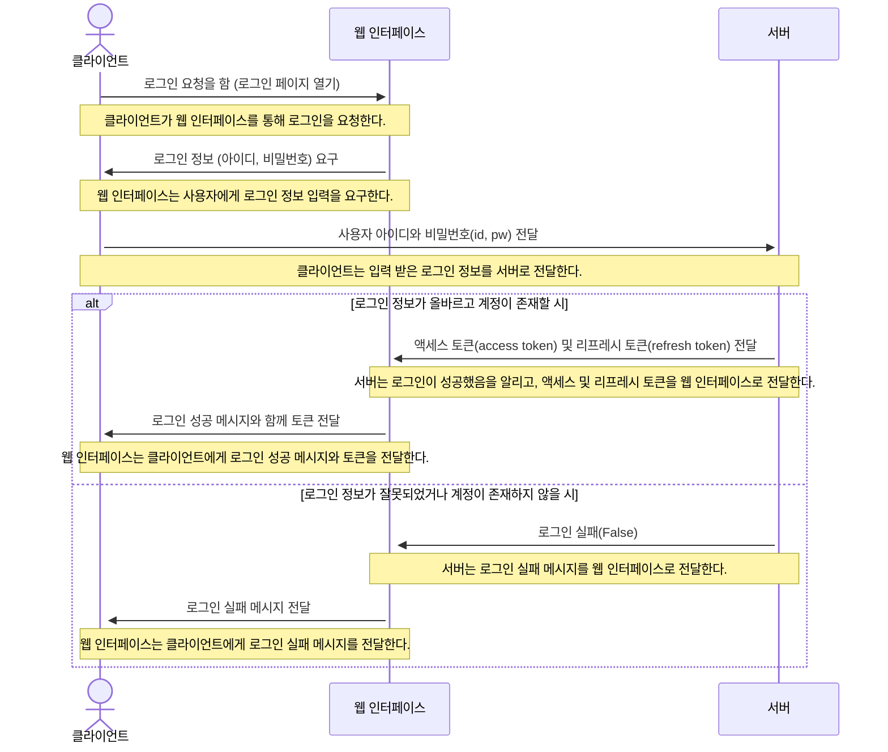
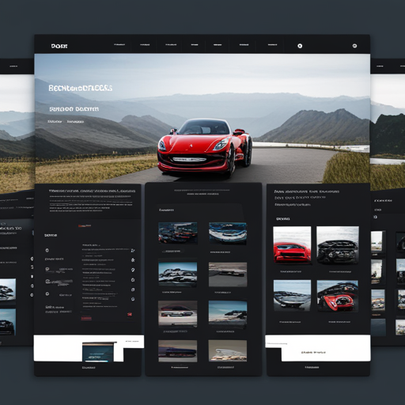
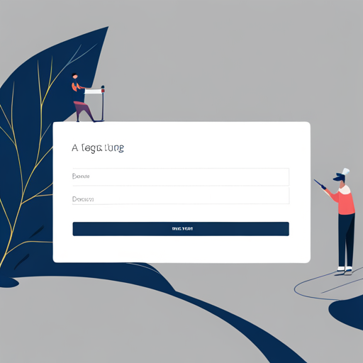
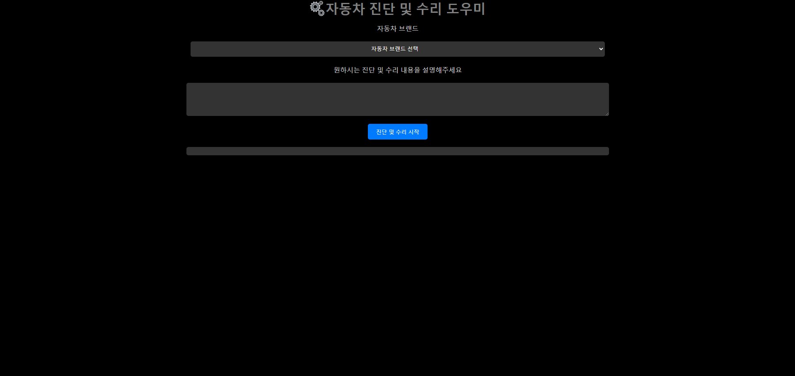
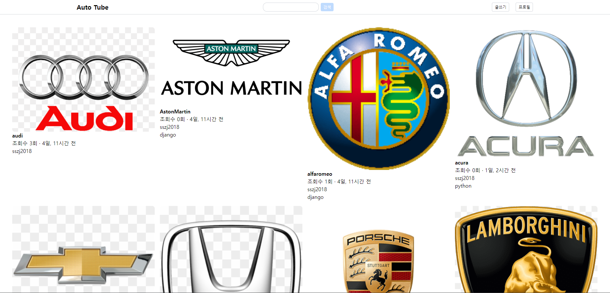
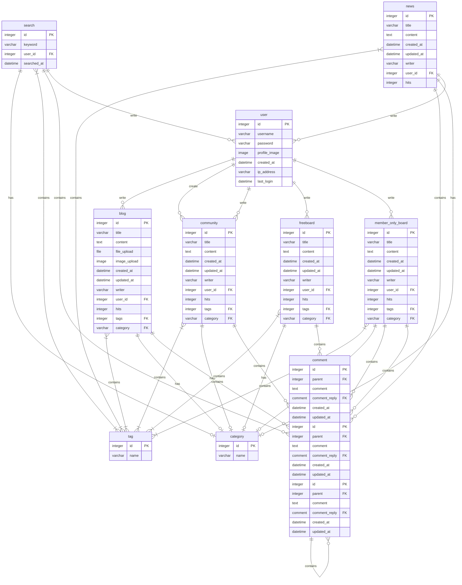
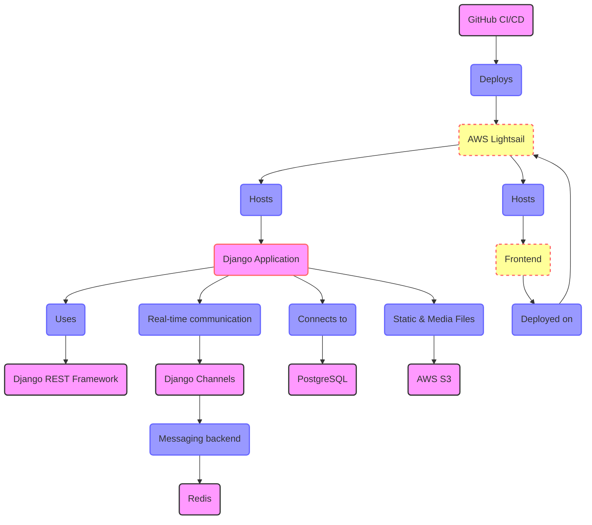

## 1. 아이디어, 목표와 기능
- Multimodal AI 기반 자동차 웹사이트 프로젝트 기획

### 1.1 아이디어
* **Multimodal AI 기술을 활용하여 텍스트, 이미지, 영상 등 다양한 방식으로 자동차 정보를 제공하는 웹사이트**
* **자동차 관련 블로그, 정보, 커뮤니티 기능을 통합하여 사용자에게 풍부한 경험 제공**

### 1.2 목표
* **자동차 애호가, 전문가, 일반 사용자 모두에게 유용한 정보 공간 제공**
* **사용자 참여를 통한 활발한 자동차 커뮤니티 구축**
* **Multimodal AI 기술 활용을 통한 차별화된 웹사이트 구축**

### 1.3 기능
* **블로그 및 정보:**
    * 자동차 뉴스, 리뷰, 비교, 튜토리얼, 가이드 등 제공
    * AI 기반 사용자 맞춤 콘텐츠 추천
* **커뮤니티:**
    * 자유 게시판, 동호회, Q&A, 리뷰 작성 등 지원
    * AI 기반 챗봇, 이미지/영상 인식 기반 소통
* **Multimodal AI:**
    * 이미지/영상 검색, 자동차 인식, 음성 인식, 챗봇 등 제공
    * AI 기반 사용자 맞춤 콘텐츠 추천
* **기타:**
    * 사용자 프로필, 알림, 검색, 마이 페이지 등 제공

**이 웹사이트는 Multimodal AI 기술을 활용하여 자동차 정보 접근성을 높이고 사용자 참여를 유도하며, 활발한 국내외 자동차 커뮤니티를 구축하는 것을 목표로 합니다.**

**참고:**

* 웹사이트 디자인 및 레이아웃은 추후 고려
* 웹사이트 운영 계획 및 수익 모델은 추후 검토


## 2. 개발 환경 및 배포 URL
### 2.1 개발 환경
- Web Framework
  - Visual Studio Code, Django

### 2.2 배포 URL
- https://github.com/SungjaeS/auto_blog

### 2.3 URL 구조
- main

| App       | URL                                        | Views Function    | HTML File Name                        | Note           |
|-----------|--------------------------------------------|-------------------|---------------------------------------|----------------|
| main      | '/'                                        | home              | main/home.html                        | 홈화면          |
| main      | '/about/'                                  | about             | main/about.html                       | 소개화면               |

- accounts

| App       | URL                                        | Views Function    | HTML File Name                        | Note           |
|-----------|--------------------------------------------|-------------------|---------------------------------------|----------------|
| accounts  | 'signup/'                                  | signup            | accounts/signup.html                  |회원가입         |
| accounts  | 'login/'                                   | login             | accounts/login.html                   |로그인           |
| accounts  | 'logout/'                                  | logout            | accounts/logout.html                  |로그아웃         |
| accounts  | 'profile/'                                 | profile           | accounts/profile.html                 | 비밀번호변경기능 / <br>프로필 수정/ 닉네임추가 |


<!-- - boardapp

| App       | URL                                        | Views Function    | HTML File Name                        | Note           |
|-----------|--------------------------------------------|-------------------|---------------------------------------|----------------|
| board     | 'board/'                                   | board             | boardapp/post_list.html               | 게시판 목록 |
| board     | 'board/<int:pk>/'                          | post_detail       | boardapp/post_detail.html            | 게시글 상세보기 |
| board     | 'board/write/'                             | post_write        | boardapp/post_write.html             | 게시글 작성 |
| board     | 'board/edit/<int:pk>/'                     | post_edit         | boardapp/post_edit.html              | 게시글 수정 |
| board     | 'board/delete/<int:pk>/'                   | post_delete       | boardapp/post_delete.html            | 게시글 삭제 |
| board     | 'board/<int:pk>/comment/'                  | comment_create    | boardapp/comment_form.html           | 댓글 작성 |
| board     | 'board/<int:pk>/comment/<br><int:comment_pk>/edit/' | comment_edit | boardapp/comment_form.html           | 댓글 수정 |
| board     | 'board/<int:pk>/comment/<br><int:comment_pk>/delete/' | comment_delete | boardapp/comment_<br>confirm_delete.html| 댓글 삭제 |
 -->

<!-- - blog


| App       | URL                                        | Views Function    | HTML File Name                        | Note           |
|-----------|--------------------------------------------|-------------------|---------------------------------------|----------------|
| blog      | 'blog/'                                    | blog              | blog/blog.html                        |갤러리형 게시판 메인 화면  |
| blog      | 'blog/<int:pk>/'                           | post              | blog/post.html                        |상세 포스트 화면    |
| blog      | 'blog/write/'                              | write             | blog/write.html                       | 카테고리 지정, 사진업로드,<br> 게시글 조회수 반영|
| blog      | 'blog/edit/<int:pk>/'                      | edit              | blog/edit.html                        | 게시물목록보기 |
| blog      | 'blog/delete/<int:pk>/'                    | delete            | blog/delete.html                      | 삭제 화면      |
| blog      | 'blog/search/'                             | search            | blog/search.html                      | 주제와 카테고리에 따라 검색,<br> 시간순에 따라 정렬|
| blog      | 'post/<int:post_pk>/comment/'              | comment_new       | blog/comment_form.html                | 댓글 입력 폼     |
| blog      | 'post/<int:post_pk>/comment/<br><int:parent_pk>/' | reply_new    | blog/comment_form.html                | 대댓글 폼      |
| blog      | 'post/<int:pk>/like/'                      | like_post         | blog/post.html                        |좋아요를 누르면 blog/post로 Redirect됨|
| blog      | 'comment/<int:pk>/update/'                 | comment_update    | blog/comment_form.html                |댓글 업데이터 경로   |
| blog      | 'comment/<int:pk>/delete/'                 | comment_delete    | blog/comment_<br>confirm_delete.html      |댓글 삭제 폼    | -->

<!-- ### 2.4 URL 구조(마이크로식)

* views의 이름과 views에 믹스인 한 것이 있으면 함께 언급하면 좋습니다.

|app:accounts|HTTP Method|설명|로그인 권한 필요|작성자 권한 필요|
|:-|:-|:-|:-:|:-:|
|signup/|POST|회원가입|||
|login/|POST|로그인|||
|logout/|POST|로그아웃| ✅ ||
|\<int:pk\>/|GET|프로필 조회| ✅ ||
|\<int:pk\>/|PUT|프로필 수정| ✅ | ✅ |
|\<int:pk\>/|DELETE|회원 탈퇴| ✅ | ✅ |
|status/|GET|로그인 상태 확인|||
|token/refresh/|POST|만료 토큰 재발급|||
<br>  

|app:blog|HTTP Method|설명|로그인 권한 필요|작성자 권한 필요|
|:-|:-|:-|:-:|:-:|
|list/|GET|게시판 리스트| ✅ ||
|create/|POST|게시물 작성| ✅ ||
<br>

|app:interview|HTTP Method|설명|로그인 권한 필요|작성자 권한 필요|
|:-|:-|:-|:-:|:-:|
|question/|POST|면접 문제 요청| ✅ ||
|grading/|POST|면접 문제 채점| ✅ ||
|total/|POST|면접 점수 통계| ✅ ||
<br>

* 아래와 같이 표현할 수도 있습니다.

| App       | Method        | URL                               | Views Class        | Note           |
|-----------|---------------|-----------------------------------|------------------- |----------------|
| blog  | GET   | '/blog/posts/'                         |   PostViewSet                 |게시글 목록 |
| blog  | POST   | '/blog/posts/'                       |   PostViewSet                 |게시글 생성 / ChatGPT API 요청 |
| blog  | GET   | '/blog/posts/{post_id}/'                |    PostViewSet       |게시글 상세보기 / 게시글 조회수 증가 |
| blog  | PATCH   | '/blog/posts/{post_id}/'                  |   PostViewSet    |게시글 수정 |
| blog  | DELETE   | '/blog/posts/{post_id}/'                   |  PostViewSet    |게시글 삭제 |
| blog  | POST   | '/blog/posts/{post_id}/like/'                   |   PostViewSet    |게시글 좋아요 증가|
| blog  | GET   | '/blog/posts/{post_id}/comments/'                   |   CommentViewSet    | 게시물의 댓글 목록 |
| blog  | POST   | '/blog/posts/{post_id}/comments/'                   |   CommentViewSet    | 게시물의 댓글 생성 |
| blog  | GET   | '/blog/posts/{post_id}/comments/{comment_id}/'       |   CommentViewSet    | 게시물의 특정 댓글 보기 |
| blog  | PATCH   | '/blog/posts/{post_id}/comments/{comment_id}/'       |   CommentViewSet    | 게시물의 특정 댓글 수정 |
| blog  | DELETE   | '/blog/posts/{post_id}/comments/{comment_id}/'       |   CommentViewSet    | 게시물의 특정 댓글 삭제 |
<br>

|URL|페이지 설명|GET|POST|PUT|DELETE|로그인 권한| 작성자 권한|
|------|---|:---:|:---:|:---:|:---:|:---:|:---:|
|/accounts/login|로그인| |✔️| | | | |
|/accounts/logout|로그아웃| |✔️| | | | |
|/accounts/signup|회원가입| |✔️| | | | |
|/accounts/profile|프로필 <br> 프로필 수정 <br> 회원 탈퇴|✔️<br> <br> <br>| |✔️|<br><br>✔️|✔️ <br> ✔️ <br> ✔️|<br> ✔️ <br> ✔️
|/accounts/token/refresh|토큰갱신| |✔️| | | | |
|/board|게시글 목록 <br> 게시글 생성|✔️<br><br>|<br>✔️| | | <br> ✔️| |
|/board/{postid}|게시글 상세 <br> 게시글 수정 <br> 게시글 삭제|✔️<br><br><br>| |✔️|<br><br>✔️| <br> ✔️ <br> ✔️ | <br> ✔️ <br> ✔️
<br> -->

## 3. 요구사항 명세와 기능 명세
<!-- - https://www.mindmeister.com/ 등을 사용하여 모델링 및 요구사항 명세를 시각화하면 좋습니다.
- 이미지는 셈플 이미지입니다.

- 머메이드를 이용해 시각화 할 수 있습니다. -->



## 4. 프로젝트 구조와 개발 일정
### 4.1 프로젝트 구조

```
auto_blog
├─ .gitignore
├─ accounts
│  ├─ admin.py
│  ├─ apps.py
│  ├─ migrations
│  │  └─ __init__.py
│  ├─ models.py
│  ├─ tests.py
│  ├─ urls.py
│  ├─ views.py
│  └─ __init__.py
├─ config
│  ├─ asgi.py
│  ├─ settings.py
│  ├─ urls.py
│  ├─ wsgi.py
│  └─ __init__.py
├─ index.html
├─ LICENSE.md
├─ manage.py
├─ readme.md
├─ requirements.txt
├─ static
├─ templates
│  ├─ accounts
│  │  ├─ login.html
│  │  ├─ profile.html
│  │  └─ signup.html
│  ├─ base.html
│  └─ tube
│     ├─ tube_create.html
│     ├─ tube_detail.html
│     ├─ tube_list.html
│     └─ tube_update.html
└─ tube
   ├─ admin.py
   ├─ apps.py
   ├─ forms.py
   ├─ migrations
   │  ├─ 0001_initial.py
   │  ├─ 0002_subscription.py
   │  └─ __init__.py
   ├─ models.py
   ├─ tests.py
   ├─ urls.py
   ├─ views.py
   └─ __init__.py

```

### 4.1 개발 일정(Work Breakdown Structure)

### 2024년 3월 7일 (목요일)
1. 리포지토리 생성
   - GitHub 또는 AWS 등에서 프로젝트를 위한 새로운 리포지토리 생성
2. 프로젝트 아이디어 기획
   - 프로젝트 목표 및 기능 정의
   - 필요한 데이터베이스 모델 및 기술 스택 결정

### 2024년 3월 8일 (금요일)
1. 와이어프레임 작성
   - 프로젝트 화면 및 기능 구성에 대한 초안 작성
2. ERD 작성
   - 데이터베이스 구조 설계를 위한 ERD 작성
3. 프로젝트 아이디어 수정
   - 프로젝트 기능 수정 및 추가
   - 데이터베이스 모델 및 기술 스택 수정

### 2024년 3월 9일 (토요일)
1. 모델 구현
   - Django 모델을 사용하여 데이터베이스 모델 구현
2. CRUD 구현
   - Create, Read, Update, Delete 기능을 구현하여 사용자가 데이터를 조작할 수 있도록 함

### 2024년 3월 10일 (일요일)
1. 인증 구현
   - 회원가입, 로그인, 로그아웃 기능 구현
2. URL 구현
   - 프로젝트의 정의된 URL 구조와 패턴 설정

### 2024년 3월 11일 (월요일)
1. AI, LLM 기능 구현
   - 기존 데이터베이스 통한 AI 서비스 연동 구현

### 2024년 3월 12일 (화요일)
1. 검사 및 수정
   - 배포전 최종 검사 및 수정

### 2024년 3월 13일 (수요일)
1. 배포 및 프로젝트 완료
   - 프로젝트를 호스팅 서비스에 배포하고 완료된 프로젝트를 공유

### 각 작업은 필요에 따라 수정이 가능하며, 각 작업에 대한 세부사항은 조정 및 연장 합니다.

## 5. UI 화면설계

### 5.1 화면설계
<!-- - 아래 페이지별 상세 설명, 더 큰 이미지로 하나하나씩 설명 필요

- 와이어 프레임은 디자인을 할 수 있다면 '피그마'를, 디자인을 할 수 없다면 '카카오 오븐'으로 쉽게 만들 수 있습니다.
### 6.2 화면 설계
- 화면은 gif파일로 업로드해주세요. -->
 
<table>
    <tbody>
        <tr>
            <td>메인</td>
            <td>로그인</td>
        </tr>
        <tr>
            <td>
		
            </td>
            <td>
                
            </td>
        </tr>
        <tr>
            <td>검색</td>
            <td>글쓰기</td>
        </tr>
        <tr>
            <td>
                
            </td>
            <td>
                
            </td>
        </tr>
    </tbody>
</table>

## 6. 데이터베이스 모델링(ERD)






## 7. Multimodal AI 기반 자동차 블로그, 정보, 커뮤니티 웹사이트 메인 기능

**웹사이트 소개:**

이 웹사이트는 Multimodal AI 기술을 활용하여 자동차 관련 블로그, 정보, 커뮤니티 기능을 제공합니다. 사용자는 텍스트, 이미지, 영상 등 다양한 방식으로 자동차 정보를 얻고 소통할 수 있습니다.

**메인 기능:**

**1. 블로그 및 정보:**

* **자동차 뉴스:** 최신 자동차 업계 뉴스 및 트렌드 제공
* **자동차 리뷰:** 전문가 및 사용자 리뷰 제공
* **자동차 비교:** 차량 모델 비교 및 분석 제공
* **튜토리얼 및 가이드:** 자동차 유지 관리, 수리, DIY 등 가이드 제공
* **AI 기반 추천:** 사용자 관심에 맞는 자동차 콘텐츠 추천

**2. 커뮤니티:**

* **자유 게시판:** 자동차 관련 질문, 토론, 정보 공유
* **동호회:** 특정 자동차 모델, 브랜드, 관심사를 중심으로 한 동호회 운영
* **Q&A:** 자동차 전문가 및 사용자 간 질의응답
* **리뷰 작성:** 사용자 리뷰 작성 및 공유
* **AI 기반 소통:** 챗봇, 이미지/영상 인식 기반 정보 제공 및 소통

**3. Multimodal AI 기능:**

* **이미지/영상 검색:** 자동차 이미지/영상 검색 및 정보 제공
* **자동차 인식:** 이미지/영상에서 자동차 모델, 브랜드, 특징 인식
* **음성 인식:** 음성 명령을 통한 정보 검색, 기능 제어
* **챗봇:** 자동차 관련 질문에 대한 자연어 답변 제공
* **AI 기반 추천:** 사용자 관심에 맞는 자동차 콘텐츠 추천

**4. 기타 기능:**

* **사용자 프로필:** 사용자 정보 관리 및 맞춤 설정
* **알림:** 새 게시글, 댓글, 추천 등 알림 제공
* **검색:** 웹사이트 내 콘텐츠 검색
* **마이 페이지:** 사용자 리뷰, 활동 내역 확인

**Multimodal AI 기술을 활용하여 사용자에게 더욱 풍부하고 효율적인 자동차 정보 및 커뮤니티 경험을 제공합니다.**

**웹사이트 운영 계획:**

* **정기적인 콘텐츠 업데이트:** 블로그 게시글, 리뷰, 튜토리얼 등
* **커뮤니티 활성화:** 이벤트, 퀴즈, 경품 등을 통한 활동 유도
* **AI 기술 발전:** 새로운 AI 기능 개발 및 적용
* **사용자 참여 유도:** 설문조사, 피드백 수렴 등을 통한 사용자 의견 반영
* **광고 및 파트너십:** 웹사이트 운영 및 콘텐츠 제작 수익 창출

**이 웹사이트는 자동차 애호가, 전문가, 일반 사용자 모두에게 유용한 정보, 커뮤니티 공간을 제공하여 자동차에 대한 관심과 지식을 높일 수 있도록 기여할 것입니다.**

<!-- ## 8. 에러와 에러 해결
- 
## 9. 개발하며 느낀점
-  -->
